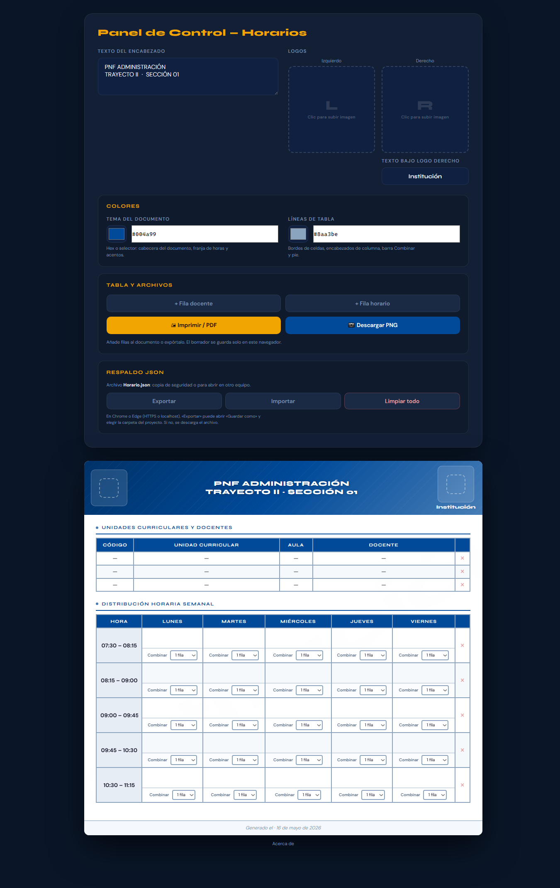

# Generador de Horarios

Herramienta web para crear horarios académicos con encabezado personalizable, tablas de docentes y distribución semanal.

## Instrucciones

Abre **`index.html`** con doble clic o arrastrándolo al navegador. La interfaz y la lógica van incrustadas en ese archivo para que funcione con rutas `file://` (sin servidor local).

**`horarios.html`** redirige a **`index.html`** por si sigues usando ese nombre como acceso directo.

Mantén **`style.css`** en la misma carpeta que el HTML.

## Características

- **Exportación a PNG**: descarga el documento como imagen de alta resolución.
- **Impresión y PDF**: usa el botón de imprimir del navegador para guardar como PDF (recuerda activar los gráficos de fondo si los colores no se ven igual que en pantalla).
- **Logos**: sube imágenes para los logos izquierdo y derecho y edita el texto bajo el logo derecho.
- **Combinación de celdas**: en el horario semanal, combina filas por día con el selector «Combinar».
- **Respaldo JSON**: exporta o importa `Horario.json` desde el panel (borrador automático en el navegador aparte).

## Estructura del proyecto

| Archivo         | Contenido                                                      |
|-----------------|----------------------------------------------------------------|
| `index.html`    | HTML, dependencias CDN y lógica React (JSX con Babel inline)   |
| `horarios.html` | Redirección a `index.html`                                     |
| `Horario.json`  | Ejemplo de respaldo JSON (opcional; puedes sobrescribirlo al exportar) |
| `style.css`     | Estilos e impresión                                            |

## Dependencias y modo sin conexión

La aplicación carga **React**, **ReactDOM**, **Babel Standalone**, **html2canvas** y las fuentes **Google Fonts** desde CDNs públicos (unpkg y fonts.googleapis.com). Si abres el proyecto **sin acceso a Internet**, esas librerías no se descargarán y la página no funcionará hasta tener conexión o hasta que empaquetes las dependencias de forma local.

Para un proyecto que deba usarse totalmente offline o si planeas añadir más módulos y un flujo de desarrollo (HMR, TypeScript, etc.), conviene migrar a un empaquetador como **Vite** y servir las dependencias desde `node_modules` o un bundle generado en la compilación.

## Licencia y créditos

Desarrollador: Raimond Caldera · Codeonyx-Dev.
